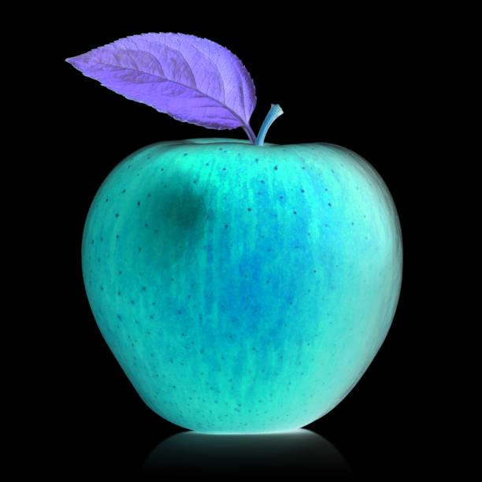
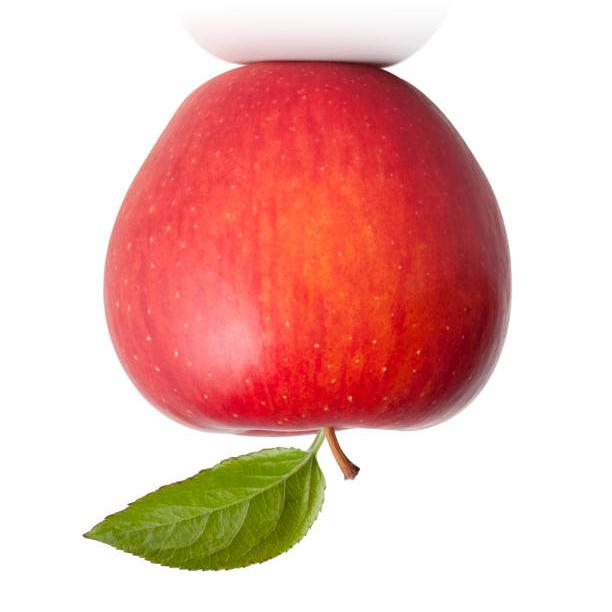
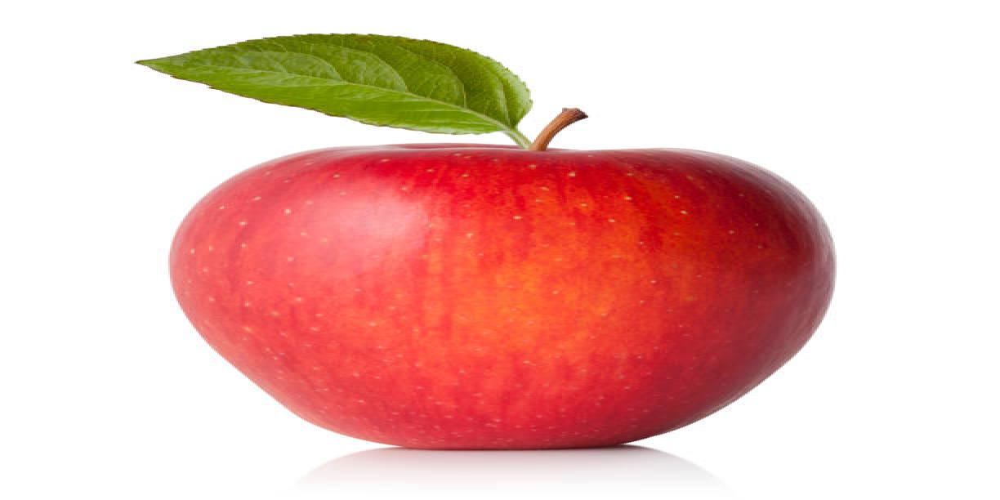
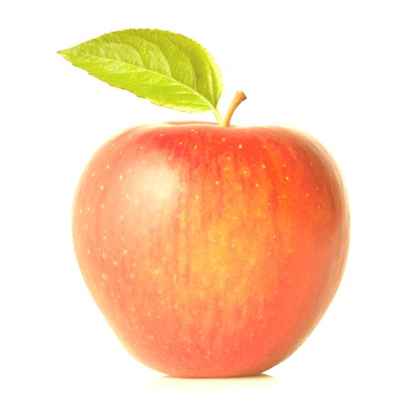
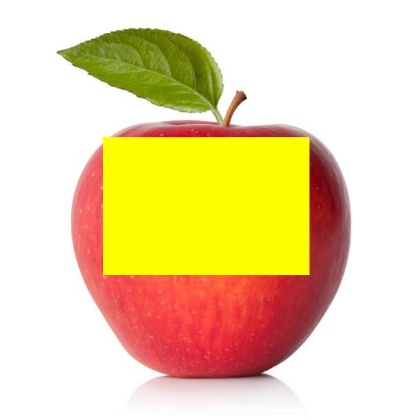

# Java Image Manipulation
#### Takes image input from file path or URL.

#### It then converts each pixel RGBA value into an integer. This is stored in a 2D array that can be manipulated.

#### These integers are sometimes converted to RGBA arrays to be manipulated.(to create filters for example) 

#### Methods do various things like invert image, filter pixel colors, and other pixel manipulation.(check out the images directory)

#### The integer arrays are finally converted back to an image and output to file.

# Example Original Image

 

# Example After Image Manipulations Through Process Explained Above

